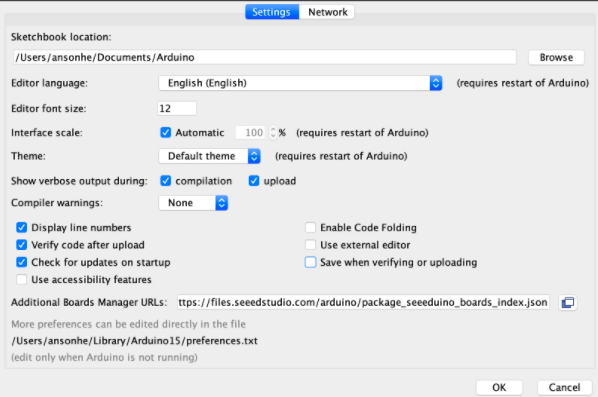
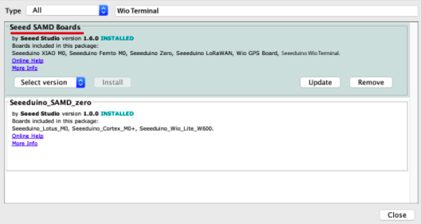
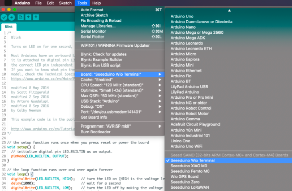
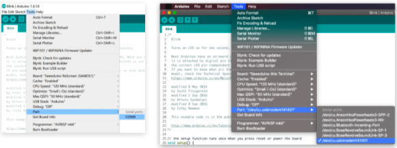
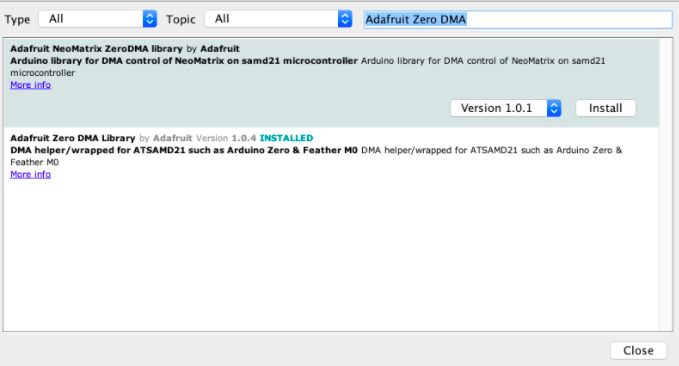
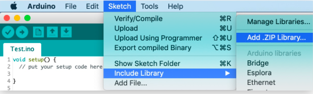

# PKE-WioTerminal

## Wio Terminal

Va a cer la pantalla de nuestro PKE meter, adonde con un potenciometro podremos elegir dos funcioens:

- Ondas sesosoidal
- Localisador de Fantasmas (con ayuda de la Raspberry pi)

### Pasos:

1. Primero hay que instar el [Arduino IDE](https://www.arduino.cc/en/software) link: https://www.arduino.cc/en/software

2. Agregue la biblioteca de tableros de terminales de Wio:

- Abre el IDE de Arduino, haga clic en **Archivo > Preferencias** y pega la siguiente URL a las URL del Administrador de tableros adicionales:

```
https://files.seeedstudio.com/arduino/package_seeeduino_boards_index.json
```

<p align="center">
  
</p>

3. Has clic en **Tools > Board > Board Manager** y Sebusca Wio Terminal en Boards Manager.

<p align="center">
  
</p>

4. Selecciona tu placa y puerto

- Deberá seleccionar la entrada en el menú **Herramientas > Tablero** que corresponda a su Arduino. Seleccionando la Wio Terminal.

<p align="center">
  
</p>

- Selecciona el dispositivo serie de la placa de terminales Wio en el menú **Herramientas > Puerto**.

<p align="center">
  
</p>

4. Descargar librerias:

- Navegue hasta el **boceto -> Incluir biblioteca -> Biblioteca del administrador**, y aparecerá una ventana del administrador de la biblioteca.

- Busque Adafruit Zero DMA y haga clic en Instalar.

<p align="center">
  
</p>

- Descarga en formato zip las siguientes librerias:
  - [Seeed_Arduino_Linechart](https://github.com/Seeed-Studio/Seeed_Arduino_Linechart): https://github.com/Seeed-Studio/Seeed_Arduino_Linechart
  - [Seeed_Arduino_LCD](https://github.com/Seeed-Studio/Seeed_Arduino_LCD): https://github.com/Seeed-Studio/Seeed_Arduino_LCD

* Abra el Arduino IDE y haga clic en **bosquejo -> Incluir biblioteca -> Agregar biblioteca .ZIP**, y elige los zips de las librerias que acaba de descargar.

<p align="center">
  
</p>

5. Abre el archivo **PKE-WioTerminal.ino** y sube lo a la Wio Terminal

## Raspberry pi

Vamos a correr el modelo de inteligencia arificial, que crearemos en [Edge Impulse](https://www.edgeimpulse.com/) y mandaremos la informacion a nuestra Wio Terminal de la ubicacion del fantasma.

### Pasos:

1. Nos conectamos por ssh:

```
ssh pi@192.168.1.19
```

2. Instalación de dependencias

- To set this device up in Edge Impulse, run the following commands:

```
curl -sL https://deb.nodesource.com/setup_12.x | sudo bash -
sudo apt install -y gcc g++ make build-essential nodejs sox gstreamer1.0-tools gstreamer1.0-plugins-good gstreamer1.0-plugins-base gstreamer1.0-plugins-base-apps
npm config set user root && sudo npm install edge-impulse-linux -g --unsafe-perm
```

3. Si tiene un módulo de cámara Raspberry Pi, también debe activarlo primero. Ejecute el siguiente comando:

```
sudo raspi-config
```

4. Connecting to Edge Impulse

```
edge-impulse-linux
```

5. Instalación del SDK de Python para Linux

```
sudo apt-get install libatlas-base-dev libportaudio0 libportaudio2 libportaudiocpp0 portaudio19-dev
pip3 install edge_impulse_linux -i https://pypi.python.org/simple
```

6. Descargamos el repositorio en nuestra Raspberry Pi:

```
git clone https://github.com/Diego-Luna/PKE-WioTerminal.git
```

- entramos en la carpeta

```
cd PKE-WioTerminal/raspberry-pi/
```

7. Descargamos el modelo de Inteligensia artificial en nuestra Raspberry Pi:

```
edge-impulse-linux-runner --download modelfile.eim
```

8. Corremos el modelo de AI:

- Conectamos la Wio Terminal a cualquier puerto de la Raspberry Pi.
- Y ejecutamos el comando:

```
python3 classify-full-frame.py ./modelfile.eim 0
```
